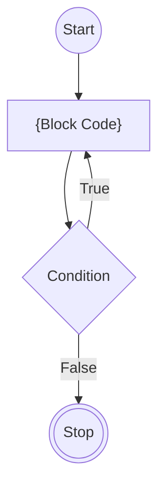

# Flowchart Do-While Loop JS

```mermaid
flowchart TD

start@{shape: circle, label: "Start"}
condition@{shape: diamond, label: "Condition"}
code@{shape: rect, label: "{Block Code}"}
stop@{shape: dbl-circ, label: "Stop"}

start-->code
code-->condition
condition--True-->code
condition--False-->stop
```