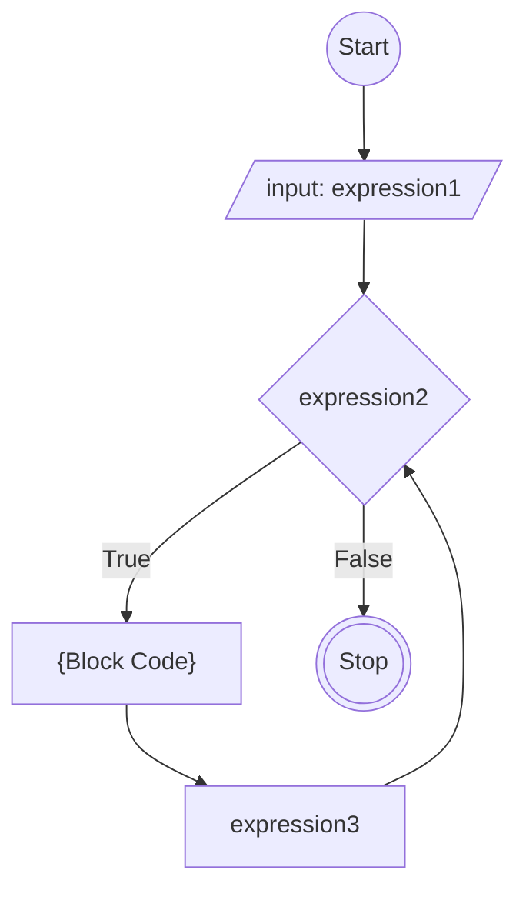

# Flowchart For Loop JS

```mermaid
flowchart TD

start@{shape: circle, label: "Start"}
exp1@{shape: lean-r, label: "input: expression1"}
exp2@{shape: diamond, label: "expression2"}
code@{shape: rect, label: "{Block Code}"}
exp3@{shape: rect, label: "expression3"}
stop@{shape: dbl-circ, label: "Stop"}

start-->exp1
exp1-->exp2
exp2--True-->code
exp2--False-->stop
code-->exp3
exp3-->exp2
```