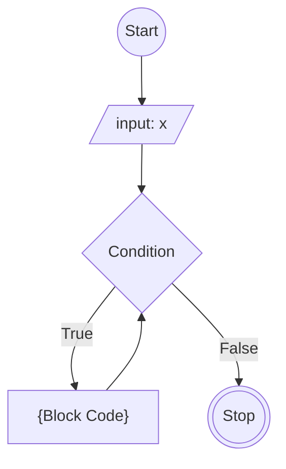

# Flowchart While Loop JS

```mermaid
flowchart TD

start@{shape: circle, label: "Start"}
input@{shape: lean-r, label: "input: x"}
condition@{shape: diamond, label: "Condition"}
code@{shape: rect, label: "{Block Code}"}
stop@{shape: dbl-circ, label: "Stop"}

start-->input
input-->condition
condition--True-->code
condition--False-->stop
code-->condition
```